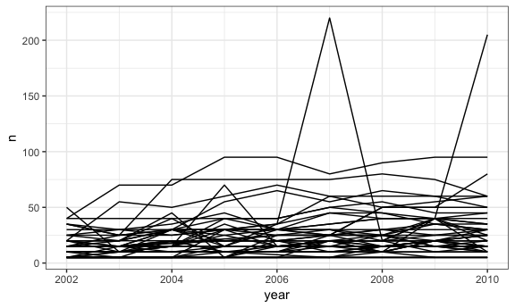
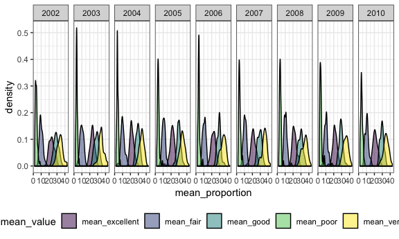

p8105\_hw3\_qw2282
================
Qinyao Wu
10/5/2018

``` r
data(brfss_smart2010)

brfss_smart2010 = janitor::clean_names(brfss_smart2010) %>% 
  filter(topic == "Overall Health") %>% #Focus on the overall health topic. 
  mutate(response = forcats::fct_relevel(response, c("Excellent","Very good" , "Good", "Fair", "Poor")))

#state observed in seven locations
brfss_smart2010 %>% 
  filter(year == 2002) %>% 
  group_by(locationabbr, locationdesc) %>%
  summarize(n = n()) %>% 
  group_by(locationabbr) %>% 
  summarize(n = n()) %>% 
  filter(n == 7)  
```

    ## # A tibble: 3 x 2
    ##   locationabbr     n
    ##   <chr>        <int>
    ## 1 CT               7
    ## 2 FL               7
    ## 3 NC               7

``` r
#States are CT, FL, NC

num_observations = brfss_smart2010 %>% 
  group_by(year, locationabbr) %>% 
  summarize(n = n())

#Make the sphaghetti plot
ggplot(data = num_observations, aes(x = year, y = n, group = locationabbr)) + geom_line()
```



``` r
summary_ny_excellent = brfss_smart2010 %>% 
  group_by(locationabbr) %>% 
  filter(locationabbr == "NY" & (year == 2002 | year == 2006 | year == 2010)) %>% 
  select(-c(topic, class, question, sample_size, confidence_limit_low:geo_location)) %>% 
  spread(key = response, value = data_value) %>% 
  group_by(year) %>% 
  summarize(mean_excellent = mean(Excellent),
            sd_tmax = sd(Excellent))

summary_ny_excellent
```

    ## # A tibble: 3 x 3
    ##    year mean_excellent sd_tmax
    ##   <int>          <dbl>   <dbl>
    ## 1  2002           24.0    4.49
    ## 2  2006           22.5    4.00
    ## 3  2010           22.7    3.57

``` r
#################################################
　b = brfss_smart2010 %>% 
  group_by(year, locationabbr) %>% 
  select(-c(topic, class, question, sample_size, confidence_limit_low:geo_location)) %>% 
  spread(key = response, value = data_value) %>% 

  summarize(mean_excellent = mean(Excellent),
            mean_very_good = mean(`Very good`),
            mean_good = mean(Good),
            mean_fair = mean(Fair),
            mean_poor = mean(Poor)) %>% 
   gather(key = mean_value, value = mean_proportion, mean_excellent:mean_poor)


 ggplot(b, aes(x = mean_proportion, fill = mean_value)) +
  geom_density(alpha = .5) + 
  facet_grid(~year) + 
  viridis::scale_fill_viridis(discrete = TRUE)
```

    ## Warning: Removed 21 rows containing non-finite values (stat_density).



Problem 2
---------

``` r
data(instacart)
```

This data set contains 1384617 and 15. Here is a list of the variables in this data set order\_id, product\_id, add\_to\_cart\_order, reordered, user\_id, eval\_set, order\_number, order\_dow, order\_hour\_of\_day, days\_since\_prior\_order, product\_name, aisle\_id, department\_id, aisle, department

``` r
instacart %>% 
  group_by(aisle) %>% #134 aisles
  summarize(n = n()) %>% 
  mutate(order_ranking = min_rank(desc(n))) %>% 
  filter(min_rank(desc(n)) < 2)  #Fresh Vegetables
```

    ## # A tibble: 1 x 3
    ##   aisle                 n order_ranking
    ##   <chr>             <int>         <int>
    ## 1 fresh vegetables 150609             1

``` r
instacart %>%
  ggplot( aes(x = aisle_id)) + 
  geom_histogram() + 
  labs(
    title = "Aisle distribution plot",
    x = "Aisle ID",
    y = "Number of orders placed"
  )
```

    ## `stat_bin()` using `bins = 30`. Pick better value with `binwidth`.


``` r
instacart %>% 
  group_by(aisle, product_name) %>% 
  filter(aisle == "baking ingredients" | aisle == "dog food care" | aisle == "packaged vegetables fruits") %>% 
  count() %>%
  group_by(aisle) %>% 
  summarize(most_popular_item =  product_name[n == max(n)])
```

    ## # A tibble: 3 x 2
    ##   aisle                      most_popular_item                            
    ##   <chr>                      <chr>                                        
    ## 1 baking ingredients         Light Brown Sugar                            
    ## 2 dog food care              Snack Sticks Chicken & Rice Recipe Dog Treats
    ## 3 packaged vegetables fruits Organic Baby Spinach

``` r
a = instacart %>% 
  filter(product_name == "Pink Lady Apples" | product_name == "Coffee Ice Cream")
```
