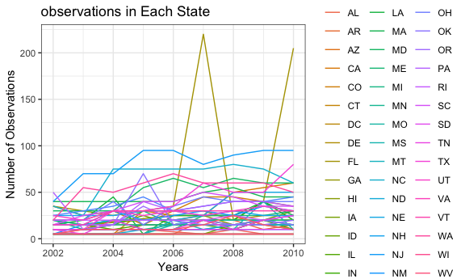
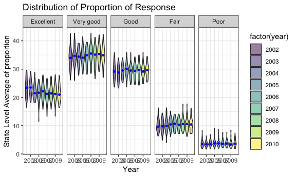
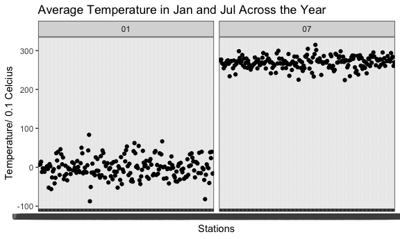
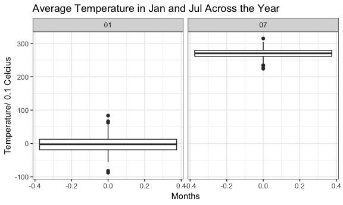
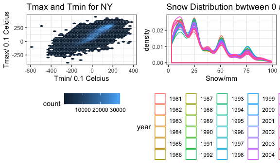

p8105\_hw3\_qw2282
================
Qinyao Wu
10/5/2018

``` r
#Read the data
data(brfss_smart2010)

brfss_smart2010 = janitor::clean_names(brfss_smart2010) %>% 
  filter(topic == "Overall Health") %>% #Focus on the overall health topic. 
  mutate(response = forcats::fct_relevel(response, c("Excellent","Very good" , "Good", "Fair", "Poor")))

#state observed in seven locations
brfss_smart2010 %>% 
  filter(year == 2002) %>% 
  group_by(locationabbr, locationdesc) %>%
  summarize(n = n()) %>% 
  group_by(locationabbr) %>% 
  summarize(n = n()) %>% 
  filter(n == 7) %>% 
  knitr::kable()
```

| locationabbr |    n|
|:-------------|----:|
| CT           |    7|
| FL           |    7|
| NC           |    7|

``` r
#States are CT, FL, NC
```

In 2002, CT, FL and NC are the states that observed at seven locations. This indicates that a lot of responses were observed in these three states compared to the others.

``` r
#Generate the total number of each states in each year. 
num_observations = brfss_smart2010 %>% 
  group_by(year, locationabbr) %>% 
  summarize(n = n())

#Make the sphaghetti plot
ggplot(data = num_observations, aes(x = year, y = n, color = locationabbr)) + geom_line() + 
  labs(
    title = "observations in Each State",
    x = "Years",
    y = "Number of Observations"
  )
```



Comment on the Sphaghetti plot: The sphaghetti plot is shown with colored locations. From the plot, we can observe that most of the states have observations between zero and a hundred. And most of the states does not have large changes from 2002 to 2010. However, there are some outliers, such as FL, which has extremely high number of observations in 2007 and 2010. This might influence the mean and standard deviation as an outlier. .

``` r
#Generate the summarize data for 2002, 2006, 2010
summary_ny_excellent = brfss_smart2010 %>% 
  group_by(year) %>% 
  filter(locationabbr == "NY" & (year == 2002 | year == 2006 | year == 2010)) %>%  #Choose only certain years. 
  select(-c(topic, class, question, sample_size, confidence_limit_low:geo_location)) %>% 
  spread(key = response, value = data_value) %>% 
  summarize(mean_excellent = mean(Excellent),
            sd_excellent = sd(Excellent))
  
  knitr::kable(summary_ny_excellent, digits = 1) # Present the table 
```

|  year|  mean\_excellent|  sd\_excellent|
|-----:|----------------:|--------------:|
|  2002|             24.0|            4.5|
|  2006|             22.5|            4.0|
|  2010|             22.7|            3.6|

This table shows the mean and standard devaiation of the proportion of excellent in 2002, 2006, and 2010. From the table we can observe that the mean of 2002 is slightly higher than that for 2006 and 2010. However, the standard deviation for 2002 is also higher than the other two years. This might be caused by some outliers in 2002 that influence the mean.

``` r
#calculate the mean proportion of each response at the state level in each year.
mean_response = brfss_smart2010 %>% 
  group_by(locationabbr, year, response) %>% 
  select(-c(topic, class, question, sample_size, confidence_limit_low:geo_location)) %>% 

  #Calculate the mean. 
  summarize(average_response = mean(data_value, na.rm = TRUE)) 


#Make the violin plot 
ggplot(mean_response, aes(x = year, y = average_response)) +
  geom_violin(aes(fill = factor(year)),  alpha = .5) + 
  
  #Split the panel with response
  facet_grid(~response) + 
  stat_summary(fun.y = median, geom = "point", color = "blue", size = 1) + 
  viridis::scale_fill_viridis(discrete = TRUE) + 
  
  #Add the labels. 
  labs(
    title = "Distribution of Proportion of Response",
    x = "Year",
    y = "State Level Average of proportion"
  )
```



Comment on the Violin plot for the proportion of response:

I choose to use a violin plot because violin plot can show both the distribution and the some descriptive data, such as the mean and the median. From the violin plot, we can observe that there are very little changes in the proportion of responses throughout the years from 2002 to 2010. The proportion for "Very Good" is always the highest while the proportion for "Poor" is always the lowest. The median has very slight changes that is hard to observe.

Problem 2
---------

``` r
#Read in the data
data(instacart)
```

Describe the dataset: This dataset is from the Instacart Online Grocery Shopping Dataset 2017 that records the online shopping lists for people from the local store. This data set contains 1384617 and 15. Here is a list of the variables in this data set order\_id, product\_id, add\_to\_cart\_order, reordered, user\_id, eval\_set, order\_number, order\_dow, order\_hour\_of\_day, days\_since\_prior\_order, product\_name, aisle\_id, department\_id, aisle, department. This table is used to record the orders received throughout a week. The item names and the aisles, in addtion to the order information are also included. For example, the first line of the data represents the Bulgarian Yogurt, on aisle of Yougut in department of Dairy Eggs, is order on the fourth day of the week. Some key variables are order\_number, order\_dow, product\_name, and aisle. This variables are important because this can help people to decide which day is important for getting certain product, and where this product can be found.

``` r
#Calculate the number of aisles and the most popular one. 
instacart %>% 
  group_by(aisle) %>% #134 aisles
  summarize(n = n()) %>% 
  mutate(order_ranking = min_rank(desc(n))) %>% 
  filter(min_rank(desc(n)) < 2) %>%  #Fresh Vegetables
  knitr::kable()
```

| aisle            |       n|  order\_ranking|
|:-----------------|-------:|---------------:|
| fresh vegetables |  150609|               1|

There are a total of 134 aisles and most items are ordered from the aisle of fresh vegetables.

``` r
#Plot the number of orders in each aisle. 

instacart %>%
  group_by(aisle) %>% 
  summarize(n = n()) %>% 
  mutate(aisle = forcats::fct_reorder(factor(aisle), n, .desc = F)) %>% 
  ggplot(aes(x = aisle, y = n)) +
  geom_point() +
  theme(text = element_text(size = 6), axis.text.x = element_text(angle = 90, hjust = 1)) + 
  labs(
    title = "Aisle Oder number distribution plot",
    x = "Aisle ID",
    y = "Number of orders placed"
  )
```

 Comment on the bar plot and the bar plot:

I choose to use bar plot to show the order distribution because this can clearly show both the extremely high values and the overall distribution in a decresing order. This plot shows the total number of order in each aisle. From the plot we can observe that there are several extreme values at the top, which indicates the fresh vagetables and fruits have extremely high order numbers. And the other ones has much fewer orders, usually around 0 to 50000.

``` r
#Find the most popular item. 

instacart %>% 
  group_by(aisle, product_name) %>% 
  filter(aisle == "baking ingredients" | aisle == "dog food care" | aisle == "packaged vegetables fruits") %>% 
  count() %>%
  group_by(aisle) %>% 
  filter(min_rank(desc(n)) < 2) %>% #Get the highest number and the corresponding product name. 
  knitr::kable()
```

| aisle                      | product\_name                                 |     n|
|:---------------------------|:----------------------------------------------|-----:|
| baking ingredients         | Light Brown Sugar                             |   499|
| dog food care              | Snack Sticks Chicken & Rice Recipe Dog Treats |    30|
| packaged vegetables fruits | Organic Baby Spinach                          |  9784|

The most ordered item in each aisles are shown in the table. We can observe that although Snack sticks Chicken and Rice Recipe Dog Treats is the most ordered for the dog food care aisle, it is the least ordered compared to the other two. And the baby Spinach is the overall most ordered.

``` r
#Find the average order time in each day of the week. 
instacart %>% 
  filter(product_name == "Pink Lady Apples" | product_name == "Coffee Ice Cream") %>%  #Filter to get the products 
  group_by(product_name, order_dow) %>%
  
  #calculate the mean hour. 
  summarize(mean_hour = mean(order_hour_of_day)) %>% 
   spread(key = order_dow, value = mean_hour) %>% #Spread to make a table
  knitr::kable(digits = 1)
```

| product\_name    |     0|     1|     2|     3|     4|     5|     6|
|:-----------------|-----:|-----:|-----:|-----:|-----:|-----:|-----:|
| Coffee Ice Cream |  13.8|  14.3|  15.4|  15.3|  15.2|  12.3|  13.8|
| Pink Lady Apples |  13.4|  11.4|  11.7|  14.2|  11.6|  12.8|  11.9|

From this table, we can observe the mean order hour of the day for Coffee Ice Cream and Pink Lady Apples. We can see that the Ice creams are ordered usually in the early afternoon, while the apples are usually ordered during the lunch time. This can be helpful for the groceries to have the most popular items out for the specific time period.

Problem 3
---------

``` r
#Read the data set. 
data(ny_noaa) 
```

This dataset is accessed from NOAA National Data Center which records the weather data from different countries. This data set contains 2595176 rows and 7. It contains the following variables: id, date, prcp, snow, snwd, tmax, tmin. Some key variables of this data set is the date, the amount of snow, the amount of precipitation, and the temperature record. With these variables, we are able to define the record of the day. There are a lot of missing data for the temperature. These missing data would become an issue because both the tmax and the tmin are missing and we cannot even estimate it. The missing data for the precipitation and snow is not as a problem because we can estimate them based on the other days.

``` r
#Do some cleaning to the dataset. 
ny_data = ny_noaa %>% 
  janitor::clean_names() %>% 
  separate(date, into = c("Year", "Month", "Day"), sep = "-") %>% #Separate the date
  janitor::clean_names() %>% 
  rename(snow_mm = snow, tmax_0.1_celcius = tmax, tmin_0.1_celcius = tmin, prcp_0.1_mm = prcp, snwd_mm = snwd) #Rename some columns to add the appropriate units. 


#Find out the most commonly observed snow amount. 
ny_data %>% 
  group_by(snow_mm) %>%
  summarise(n = n()) %>% 
  mutate(temp_ranking = min_rank(desc(n))) %>% #Rank the numer of mm of snow. 
  filter(min_rank(desc(n)) < 2)  #0 is the most frequently observed value. 
```

    ## # A tibble: 1 x 3
    ##   snow_mm       n temp_ranking
    ##     <int>   <int>        <int>
    ## 1       0 2008508            1

The most commonly observed value for snow fall is zero. This is because most of the time throughout the year, New york do not get any snow except for winter. As a result, a snow fall value of 0 mm will be observed most frequently.

``` r
#Generate the figure for the mean temperature for january and july. 
ny_jan_jul = ny_data %>% 
  group_by(id, month) %>% 
  mutate(tmax_0.1_celcius = as.numeric(tmax_0.1_celcius, na.rm = TRUE)) %>% 
  filter(month == "01" | month == "07") %>%
  na.omit(tmax_0.1_celcius) %>% 
  summarize(mean_temp = mean(tmax_0.1_celcius)) 

#Make the plot. 
  ggplot(ny_jan_jul, aes( x = id, y = mean_temp)) +
  geom_point() + 
  facet_grid(~month) + 
  labs(
    title = "Average Temperature in Jan and Jul Across the Year",
    x = "Stations",
    y = "Temperature/ 0.1 Celcius"
  )
```



``` r
  #Make an additional boxplot plot
  ggplot(ny_jan_jul, aes(y = mean_temp)) +
    geom_boxplot() +
    facet_grid(~month) +
    labs(
    title = "Average Temperature in Jan and Jul Across the Year",
    x = "Months",
    y = "Temperature/ 0.1 Celcius"
  )
```



The observable structure of the pattern is that the temperature in all stations in January is near or under zero degrees, while the temperarture in all stations in july is over 20 degrees. There is no obvious outliers that can be observed in the scatter plot.

However, with the addtional boxpplot, the outliers can be seen more clearly. The temperature in July has two outliers, one above 30 degree Celcius and one below 25 degree Celcius.

``` r
library(patchwork)

figure_temp = ny_data %>% 
  na.omit(tmin_0.1_celcius) %>% 
  na.omit(tmax_0.1_celcius) %>% 
  
  #Change the numbers in temperature into numerics, remove the NA. 
  mutate(tmax_0.1_celcius = as.numeric(tmax_0.1_celcius, na.rm = TRUE)) %>%
  mutate(tmin_0.1_celcius = as.numeric(tmin_0.1_celcius, na.rm = TRUE)) %>%
  
  #Make the plot
  ggplot(aes(x = tmin_0.1_celcius, y = tmax_0.1_celcius)) + 
  geom_hex() +
  
  theme(legend.position = "bottom") +
  labs(
    title = "Tmax and Tmin for NY",
    x = "Tmin/ 0.1 Celcius",
    y = "Tmax/ 0.1 Celcius"
  )

#Plot a figure with snow between 0 and 100 mm. 
figure_snow = ny_snow = ny_data %>% 
  filter(snow_mm > 0, snow_mm < 100)  %>% 
  ggplot(aes(x = snow_mm, color = year)) +
  geom_density(alpha = 0.2) +
  theme(legend.position = "bottom") +
  labs(
    title = "Snow Distribution bwtween 0 and 100 for NY",
    x = "Snow/mm"
  )

#Combine the two figures together. 
figure_temp + figure_snow
```



From these hex plots, we first notice that the temprature in the middle, which is around -10 celcius to 10 celcius are more commonly observed. This is caused by the long winter time in New York. The lighter blue indicates the temperature combination is very common. And from the snow distribution figure, we can observe that the most commonly observed snow is from 0 to 25. And snow above 100 mm is very rare. The amount of snow does not change too much across the years.
