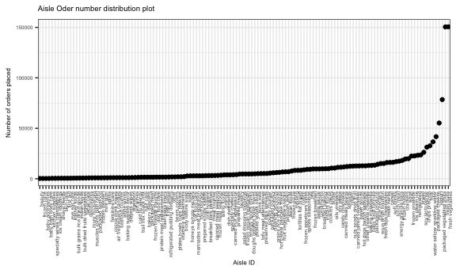

p8105\_hw3\_qw2282
================
Qinyao Wu
10/5/2018

``` r
data(brfss_smart2010)

brfss_smart2010 = janitor::clean_names(brfss_smart2010) %>% 
  filter(topic == "Overall Health") %>% #Focus on the overall health topic. 
  mutate(response = forcats::fct_relevel(response, c("Excellent","Very good" , "Good", "Fair", "Poor")))

#state observed in seven locations
brfss_smart2010 %>% 
  filter(year == 2002) %>% 
  group_by(locationabbr, locationdesc) %>%
  summarize(n = n()) %>% 
  group_by(locationabbr) %>% 
  summarize(n = n()) %>% 
  filter(n == 7)  
```

    ## # A tibble: 3 x 2
    ##   locationabbr     n
    ##   <chr>        <int>
    ## 1 CT               7
    ## 2 FL               7
    ## 3 NC               7

``` r
#States are CT, FL, NC
```

In 2002, CT, FL and NC are the states that observed at seven locations. This indicates that a lot of responses were observed in these three states complared to the others.

``` r
num_observations = brfss_smart2010 %>% 
  group_by(year, locationabbr) %>% 
  summarize(n = n())

#Make the sphaghetti plot
ggplot(data = num_observations, aes(x = year, y = n, color = locationabbr)) + geom_line() 
```

 The sphaghetti plot is shown with colored locations.

``` r
summary_ny_excellent = brfss_smart2010 %>% 
  group_by(locationabbr) %>% 
  filter(locationabbr == "NY" & (year == 2002 | year == 2006 | year == 2010)) %>% 
  select(-c(topic, class, question, sample_size, confidence_limit_low:geo_location)) %>% 
  spread(key = response, value = data_value) %>% 
  group_by(year) 
  knitr::kable(summary_ny_excellent)
```

|  year| locationabbr | locationdesc            |  Excellent|  Very good|  Good|  Fair|  Poor|
|-----:|:-------------|:------------------------|----------:|----------:|-----:|-----:|-----:|
|  2002| NY           | NY - Kings County       |       19.5|       27.5|  37.2|  11.9|   3.9|
|  2002| NY           | NY - Nassau County      |       26.9|       39.7|  22.5|   8.4|   2.4|
|  2002| NY           | NY - New York County    |       27.9|       28.7|  25.4|  12.9|   5.1|
|  2002| NY           | NY - Queens County      |       18.8|       29.1|  32.6|  15.4|   4.1|
|  2002| NY           | NY - Suffolk County     |       27.1|       28.2|  30.2|   9.5|   4.9|
|  2006| NY           | NY - Kings County       |       19.2|       25.9|  36.3|  15.3|   3.3|
|  2006| NY           | NY - Nassau County      |       21.7|       35.0|  28.2|  11.6|   3.5|
|  2006| NY           | NY - New York County    |       28.8|       32.3|  23.5|  11.5|   3.9|
|  2006| NY           | NY - Queens County      |       18.9|       25.9|  36.6|  16.3|   2.3|
|  2006| NY           | NY - Suffolk County     |       20.6|       35.8|  30.3|  10.7|   2.7|
|  2006| NY           | NY - Westchester County |       26.0|       32.8|  26.3|  13.0|   1.9|
|  2010| NY           | NY - Bronx County       |       17.6|       25.9|  35.1|  16.7|   4.7|
|  2010| NY           | NY - Erie County        |       17.2|       37.9|  29.6|  12.7|   2.5|
|  2010| NY           | NY - Kings County       |       22.4|       27.7|  30.6|  13.8|   5.5|
|  2010| NY           | NY - Monroe County      |       22.4|       33.2|  30.0|  11.0|   3.5|
|  2010| NY           | NY - Nassau County      |       26.2|       38.9|  25.4|   7.3|   2.3|
|  2010| NY           | NY - New York County    |       25.8|       38.0|  21.4|  10.3|   4.5|
|  2010| NY           | NY - Queens County      |       21.2|       29.8|  32.4|  13.9|   2.7|
|  2010| NY           | NY - Suffolk County     |       24.6|       35.5|  29.6|   7.7|   2.6|
|  2010| NY           | NY - Westchester County |       26.9|       40.3|  25.2|   5.3|   2.2|

``` r
summary_ny_excellent
```

    ## # A tibble: 20 x 8
    ## # Groups:   year [3]
    ##     year locationabbr locationdesc Excellent `Very good`  Good  Fair  Poor
    ##    <int> <chr>        <chr>            <dbl>       <dbl> <dbl> <dbl> <dbl>
    ##  1  2002 NY           NY - Kings …      19.5        27.5  37.2  11.9   3.9
    ##  2  2002 NY           NY - Nassau…      26.9        39.7  22.5   8.4   2.4
    ##  3  2002 NY           NY - New Yo…      27.9        28.7  25.4  12.9   5.1
    ##  4  2002 NY           NY - Queens…      18.8        29.1  32.6  15.4   4.1
    ##  5  2002 NY           NY - Suffol…      27.1        28.2  30.2   9.5   4.9
    ##  6  2006 NY           NY - Kings …      19.2        25.9  36.3  15.3   3.3
    ##  7  2006 NY           NY - Nassau…      21.7        35    28.2  11.6   3.5
    ##  8  2006 NY           NY - New Yo…      28.8        32.3  23.5  11.5   3.9
    ##  9  2006 NY           NY - Queens…      18.9        25.9  36.6  16.3   2.3
    ## 10  2006 NY           NY - Suffol…      20.6        35.8  30.3  10.7   2.7
    ## 11  2006 NY           NY - Westch…      26          32.8  26.3  13     1.9
    ## 12  2010 NY           NY - Bronx …      17.6        25.9  35.1  16.7   4.7
    ## 13  2010 NY           NY - Erie C…      17.2        37.9  29.6  12.7   2.5
    ## 14  2010 NY           NY - Kings …      22.4        27.7  30.6  13.8   5.5
    ## 15  2010 NY           NY - Monroe…      22.4        33.2  30    11     3.5
    ## 16  2010 NY           NY - Nassau…      26.2        38.9  25.4   7.3   2.3
    ## 17  2010 NY           NY - New Yo…      25.8        38    21.4  10.3   4.5
    ## 18  2010 NY           NY - Queens…      21.2        29.8  32.4  13.9   2.7
    ## 19  2010 NY           NY - Suffol…      24.6        35.5  29.6   7.7   2.6
    ## 20  2010 NY           NY - Westch…      26.9        40.3  25.2   5.3   2.2

``` r
　mean_response = brfss_smart2010 %>% 
  group_by(year, locationabbr) %>% 
  select(-c(topic, class, question, sample_size, confidence_limit_low:geo_location)) %>% 
  spread(key = response, value = data_value) %>% 

  summarize(mean_excellent = mean(Excellent),
            mean_very_good = mean(`Very good`),
            mean_good = mean(Good),
            mean_fair = mean(Fair),
            mean_poor = mean(Poor)) %>% 
   gather(key = mean_value, value = mean_proportion, mean_excellent:mean_poor)


 ggplot(mean_response, aes(x = mean_proportion, fill = mean_value)) +
  geom_density(alpha = .5) + 
  facet_grid(~mean_value) + 
  viridis::scale_fill_viridis(discrete = TRUE)
```

    ## Warning: Removed 21 rows containing non-finite values (stat_density).


Problem 2
---------

``` r
data(instacart)
```

This data set contains 1384617 and 15. Here is a list of the variables in this data set order\_id, product\_id, add\_to\_cart\_order, reordered, user\_id, eval\_set, order\_number, order\_dow, order\_hour\_of\_day, days\_since\_prior\_order, product\_name, aisle\_id, department\_id, aisle, department. Some key variables are product\_name, aisle.

``` r
instacart %>% 
  group_by(aisle) %>% #134 aisles
  summarize(n = n()) %>% 
  mutate(order_ranking = min_rank(desc(n))) %>% 
  filter(min_rank(desc(n)) < 2)  #Fresh Vegetables
```

    ## # A tibble: 1 x 3
    ##   aisle                 n order_ranking
    ##   <chr>             <int>         <int>
    ## 1 fresh vegetables 150609             1

``` r
instacart %>%
  ggplot( aes(x = aisle_id)) + 
  geom_histogram() + 
  labs(
    title = "Aisle distribution plot",
    x = "Aisle ID",
    y = "Number of orders placed"
  )
```

    ## `stat_bin()` using `bins = 30`. Pick better value with `binwidth`.



``` r
instacart %>% 
  group_by(aisle, product_name) %>% 
  filter(aisle == "baking ingredients" | aisle == "dog food care" | aisle == "packaged vegetables fruits") %>% 
  count() %>%
  group_by(aisle) %>% 
  arrange(n) %>% 
  filter(min_rank(desc(n)) < 2) %>% 
  knitr::kable()
```

| aisle                      | product\_name                                 |     n|
|:---------------------------|:----------------------------------------------|-----:|
| dog food care              | Snack Sticks Chicken & Rice Recipe Dog Treats |    30|
| baking ingredients         | Light Brown Sugar                             |   499|
| packaged vegetables fruits | Organic Baby Spinach                          |  9784|

``` r
time_order = instacart %>% 
  filter(product_name == "Pink Lady Apples" | product_name == "Coffee Ice Cream") %>% 
  group_by(product_name, order_dow) %>% 
  summarize(mean_hour = mean(order_hour_of_day)) %>% 
   spread(key = order_dow, value = mean_hour) %>%
  knitr::kable()
```

Problem 3
---------

``` r
data(ny_noaa) 

ny_data = ny_noaa %>% 
  janitor::clean_names() %>% 
  separate(date, into = c("Year", "Month", "Day"), sep = "-") %>% 
  janitor::clean_names() 


ny_data %>%  
   group_by(snow) %>%
  summarise(n = n()) %>% 
  mutate(temp_ranking = min_rank(desc(n))) %>% 
  filter(min_rank(desc(n)) < 2)  #0 is the most frequently observed value. 
```

    ## # A tibble: 1 x 3
    ##    snow       n temp_ranking
    ##   <int>   <int>        <int>
    ## 1     0 2008508            1

``` r
ny_jan_jul = ny_data %>% 
  group_by(id, month) %>% 
  mutate(tmax = as.numeric(tmax, na.rm = TRUE)) %>% 
  mutate(tmin = as.numeric(tmin, na.rm = TRUE)) %>%
  filter(month == "01" | month == "07") %>%
  summarize(mean_tmax = mean((tmax + tmin)/2)) %>% 
  na.omit(mean_tmax) 
  ggplot(ny_jan_jul, aes( x = id, y = mean_tmax)) +
  geom_point() + 
  facet_grid(~month) + 
  viridis::scale_fill_viridis(discrete = TRUE)
```


``` r
ny_noaa %>% 
  mutate(tmax = as.numeric(tmax, na.rm = TRUE)) %>% 
  mutate(tmin = as.numeric(tmin, na.rm = TRUE)) %>%
ggplot(aes(x = tmax, y = tmin)) + 
  geom_hex()
```

    ## Warning: Removed 1136276 rows containing non-finite values (stat_binhex).

    ## Warning: Computation failed in `stat_binhex()`:
    ## Package `hexbin` required for `stat_binhex`.
    ## Please install and try again.


``` r
ny_snow = ny_data %>% 
  filter(snow >0, snow < 100) 
  ggplot(ny_snow, aes(x = snow, fill = year)) +
  geom_density(alpha = 0.2)
```


